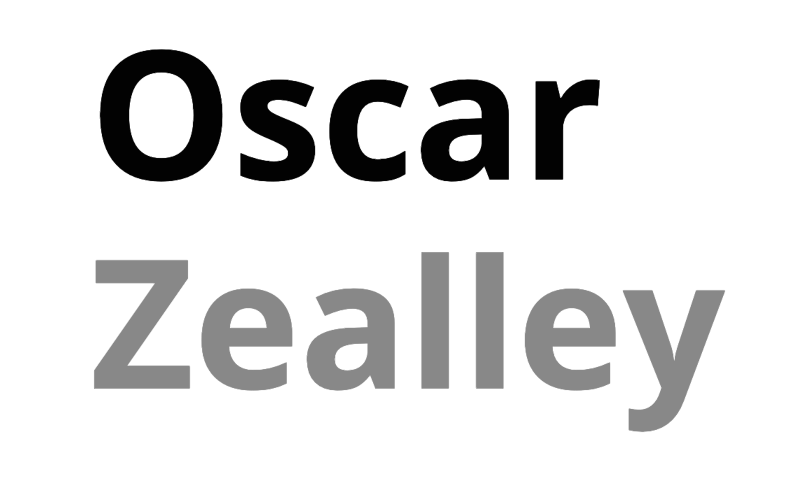

  

## Table of Contents

- [About](#about)
- [Built With](#built-with)
- [Acknowledgements](#acknowledgements)
- [License](#license)

## About

This is the repo for my personal website where I present some info about myself and the coding side projects I get involved with outside of my day job!

Check it out at https://www.oscarzealley.com/.

## Built With

- [Gatsby](https://www.gatsbyjs.com/) - React based JS Framework
- [Typescript](https://www.typescriptlang.org/) - JS specification
- [NPM](https://www.npmjs.com/) - JS Package Manager
- [Styled Components](https://styled-components.com/) - Styling
- [Contentful](https://www.contentful.com/) - Content Management

## Acknowledgements

- [ESLint](https://eslint.org/) - Linter
- [Prettier](https://prettier.io/) - Code formatter
- [Google Analytics](https://analytics.google.com/analytics/web/) - Site analytics
- [React Spring](https://www.react-spring.io/) - Animation library
- [React Helmet](https://www.npmjs.com/package/react-helmet) - Document Head Manager
- [React Grid System](https://www.npmjs.com/package/react-grid-system) - Layout Tool
- [React Multi Carousel](https://www.npmjs.com/package/react-multi-carousel) - Carousel library
- [Raw Pixel](https://www.rawpixel.com/) - Images
- [Font Awesome](https://fontawesome.com/) - Icons

## License

[BSD Zero Clause License](https://choosealicense.com/licenses/0bsd/)
